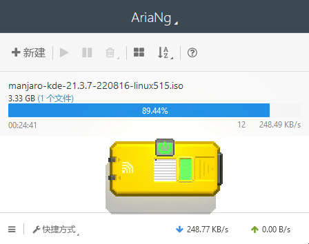

# Retro Gadgets - Aria2 Download Monitor

[Retro Gadgets lua typedef](https://github.com/DarkMio/retro-gadgets-typedefs)

Press F11 put this widget to the desktop!

## Build

* set `"../retro-gadgets-typedefs/typedefs/**/*.d.ts"` in the `tsconfig.json` to `typedefs` dir ([Retro Gadgets lua typedef](https://github.com/DarkMio/retro-gadgets-typedefs))
* `npm install`
* `npm run dev`
* the `.ts` files under `src` dir, will be compiled to `.lua` under `build` dir
* copy all `.lua` files content into the game, name the scripts without `.lua` postfix

Try to use lua builtins, it is faster then javascript builtins, because it doesn't need a polyfill
